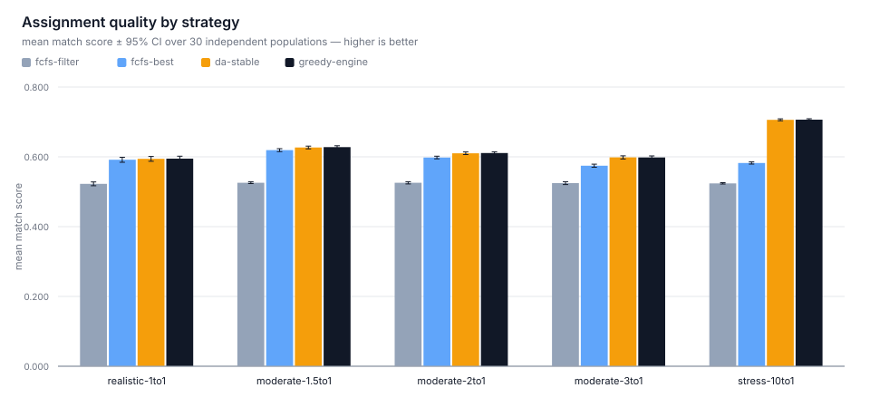
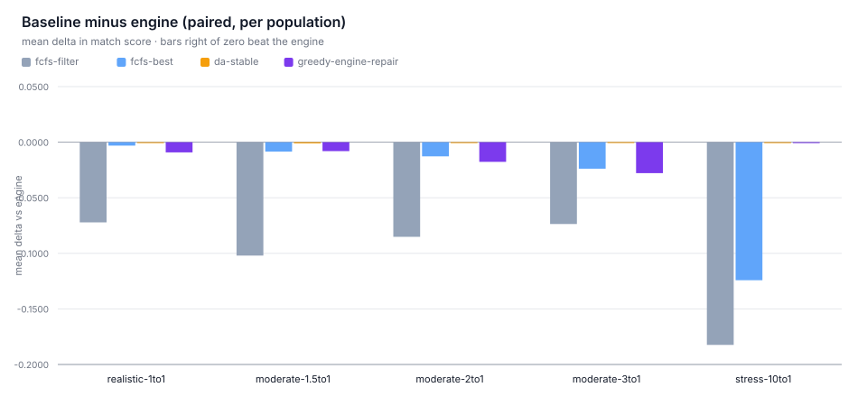
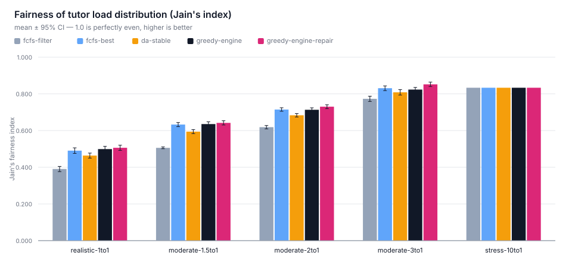
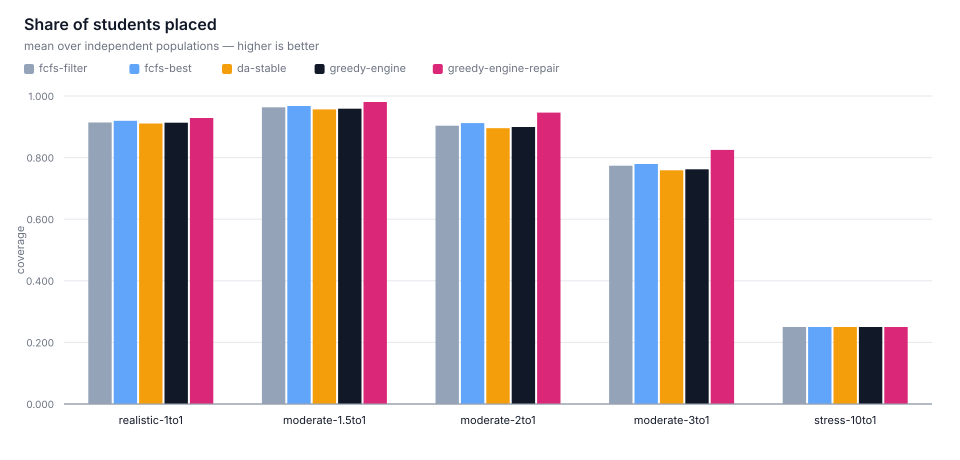
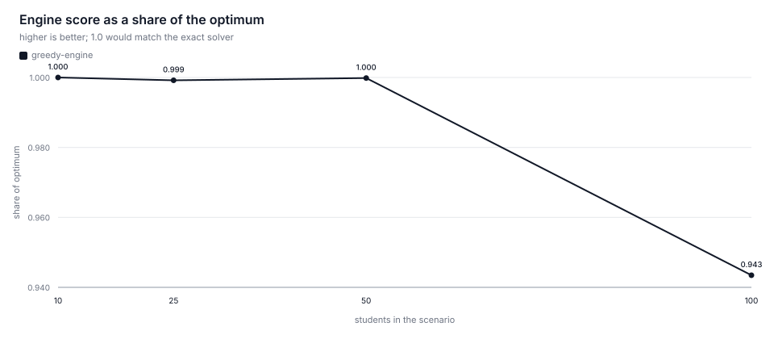
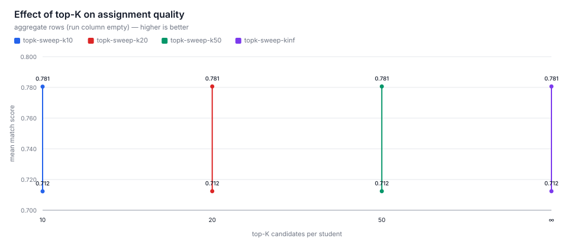
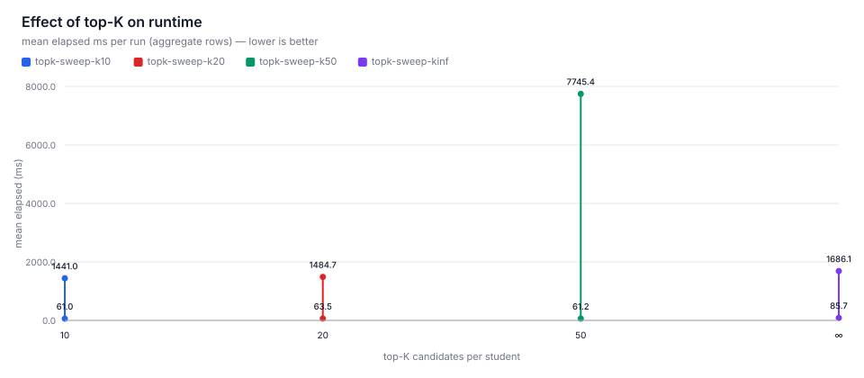

# Evaluation figures

Generated by `pnpm run eval:report` from the CSVs in `docs/benchmarks/`.
Regenerate everything with `pnpm run eval:all`.

### F1 · Assignment quality by strategy

Mean match score per scenario across 30 independent populations; whiskers are 95% confidence intervals. Overlapping intervals mean the strategies are not distinguishable on this metric.

Source: `docs/benchmarks/baseline-statistics-results.csv` · [`f1-quality-by-strategy.svg`](figures/f1-quality-by-strategy.svg) · [`f1-quality-by-strategy.png`](figures/f1-quality-by-strategy.png)

### F2 · Each baseline against the engine

Mean per-population difference (strategy − engine). Bars right of zero mean that strategy scored higher than the engine. 4 comparison(s) are significant at p < 0.05.

Source: `docs/benchmarks/baseline-statistics-results.csv` · [`f2-delta-vs-engine.svg`](figures/f2-delta-vs-engine.svg) · [`f2-delta-vs-engine.png`](figures/f2-delta-vs-engine.png)

### F3 · Fairness (Jain's index)

Jain's fairness index over tutor loads; 1.0 is perfectly even. Whiskers are 95% confidence intervals across populations.

Source: `docs/benchmarks/baseline-statistics-results.csv` · [`f3-fairness-jain.svg`](figures/f3-fairness-jain.svg) · [`f3-fairness-jain.png`](figures/f3-fairness-jain.png)

### F4 · Coverage (share of students placed)

Mean share of students that received a placement. Reported alongside F1 because a higher mean score can coexist with more unplaced students.

Source: `docs/benchmarks/baseline-statistics-results.csv` · [`f4-coverage.svg`](figures/f4-coverage.svg) · [`f4-coverage.png`](figures/f4-coverage.png)

### F5 · Engine versus the optimal assignment

Share of the min-cost-max-flow optimum the greedy engine achieves, by problem size. Worst observed ratio: 94.34%.

Source: `docs/benchmarks/optimality-gap-results.csv` · [`f5-optimality-gap.svg`](figures/f5-optimality-gap.svg) · [`f5-optimality-gap.png`](figures/f5-optimality-gap.png)

### F6 · Quality against candidate-list size (top-K)

Mean match score as the candidate list grows. The plateau is the point: raising top-K past it buys nothing but scoring cost.

Source: `docs/benchmarks/topk-sweep-results.csv` · [`f6-topk-quality.svg`](figures/f6-topk-quality.svg) · [`f6-topk-quality.png`](figures/f6-topk-quality.png)

### F7 · Scoring cost against top-K

Mean elapsed milliseconds per run as the candidate list grows. Read with F6: this is what the flat part of the quality curve costs.

Source: `docs/benchmarks/topk-sweep-results.csv` · [`f7-topk-cost.svg`](figures/f7-topk-cost.svg) · [`f7-topk-cost.png`](figures/f7-topk-cost.png)

